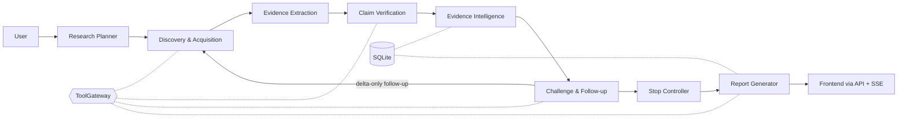

# Sarvam

**Evidence-First Autonomous Research Agent**

*Research that knows when it isn't done.*

Sarvam is an evidence-first autonomous research agent for the GATEWAYS 2026 ResearchOps challenge. It takes an open-ended business question, plans the evidence it needs, gathers sources, and produces a structured report in which every finding is traceable to a stored passage, and it tells you plainly when the evidence is not yet sufficient.

## Problem

Most AI research tools optimize for finding information and writing a fluent answer. Fluency is not support: a report can cite ten pages that all repeat one press release, quietly contain conflicting numbers, or stop because there was enough text to write with rather than enough evidence to decide. Citations and multi-step search are now table stakes; what is under-served is knowing whether the answer is supported.

## What Sarvam does

- **Plans** the question into decision dimensions, each with named evidence slots, a critical flag and allowed attributes.
- **Researches** each slot across multiple sources and records provenance for every one.
- **Extracts** addressable passages and claims that carry a verbatim quote from a stored passage.
- **Assures** the evidence: an independent verifier, origin clustering, numeric conflict detection and a rule-based coverage matrix.
- **Challenges** its own draft conclusion and runs targeted follow-up research.
- **Stops** by explicit rules and reports a final state with a termination reason.
- **Reports** findings that cite stored evidence IDs and carry a certainty label.

## Core USP

> Research that knows when it isn't done.

The agent stops when a rule-based sufficiency policy is satisfied or a hard limit is hit, and it shows the reason. Four moments are always visible: the coverage matrix, independence collapse ("9 sources, 3 independent origins"), claim-to-passage drill-down, and the stop card. Sarvam is an evidence-assurance layer over a research pipeline; it does not claim to detect truth.

## How it works

One backend process, one SQLite database, one frontend. A run is a single asyncio task driven by a deterministic controller. Every external effect (search, fetch, LLM) passes through a single ToolGateway.

## Architecture overview

| Component | Role |
| --- | --- |
| Frontend | Vite + React + TypeScript SPA; renders REST snapshots and the SSE event stream. |
| API | FastAPI; runs, event stream, state, claim evidence, report, stop. |
| Controller | Deterministic state machine; owns rounds, budgets, retries, wrap-up, stop decision. |
| ToolGateway | Only path to search, fetch and LLM; budgets, SSRF guard, concurrency, typed errors, record/replay. |
| Pipeline / Intel / Synthesis | Code modules that turn a question into sources, claims, assurance state and a report. |
| Store | SQLite (WAL, no ORM) plus a local artifact folder; the events table is the audit log. |

Details: [docs/architecture](docs/architecture/README.md).

## Research lifecycle

Ten states: PLAN, DISCOVER, ACQUIRE, EXTRACT, CLAIMS, VERIFY, ANALYZE, CHALLENGE, STOP POLICY, SYNTHESIZE. Round 0 is the initial pass; follow-up rounds are created by coverage gaps and challenges and process only new sources and claims. At least one challenge round runs; if a hard limit hits first, the controller takes a wrap-up path and the stop card says the challenge was not completed.

## Evidence-first principles

- Evidence is the system of record; the report is a view over it.
- Every claim carries a passage ID and a quote that is checked, by code, to occur in that passage.
- Citations are rendered from stored IDs, never from model-typed URLs.
- Coverage counts independent origins, not pages.
- Contradictions stay visible; a losing claim is never dropped.
- Uncertainty is stated (certainty labels), not smoothed over.

## Assurance mechanisms

| Mechanism | Type | Purpose |
| --- | --- | --- |
| Quote guard | Deterministic | Reject claims whose quote is not in the cited passage. |
| Independent verifier | Separate LLM call | Label claim-passage pairs supports / partial / contradicts / irrelevant. |
| Origin clustering | Deterministic | Collapse copied or derivative sources; unknown independence stays unknown. |
| Numeric conflicts | Deterministic + explainer | Normalize units, currency, period; flag conflicts above tolerance. |
| Coverage | Deterministic | RED / AMBER / GREEN per slot with a human-readable reason. |
| Challenge loop | LLM + rules | Attack the weakest slots; outcomes assigned by rule. |
| Stop policy | Deterministic | Final state and termination reason as a pure function of stored tables. |
| Report verifier | Deterministic | Remove or tag sentences without a claim ID or with unsupported numbers. |

## UI/UX overview

A left rail (question, phase stepper, budget meters, LIVE/REPLAY badge), a central tabbed area (Matrix, Evidence, Conflicts, Challenge, Report) and a right evidence drawer. State is always conveyed by color, icon and text together; body text is at least 16 px for projector readability; every change of direction shows a one-line reason.

## Technology stack

| Layer | Choice |
| --- | --- |
| Frontend | Bun, Vite, React, TypeScript (strict), Tailwind CSS, native EventSource |
| Backend | Python 3.11+, FastAPI, Uvicorn, Pydantic v2, asyncio, sqlite3 |
| Storage | SQLite (WAL), local artifact folder |
| Contracts | Pydantic models; JSON Schema and TypeScript types generated from them |
| Tooling | uv, pytest, ruff, GNU Make |

## Repository architecture

| Path | Contents |
| --- | --- |
| `contracts/` | Canonical Pydantic models, event envelope, typed config, schema export; `generated/` output |
| `backend/` | API, controller, `gateway/`, `pipeline/`, `intel/`, `synth/`, `store/`, `prompts/` |
| `frontend/` | Vite + React + TypeScript application shell |
| `fixtures/` | Synthetic corpus, expected outputs, golden questions |
| `tests/` | Unit tests, fixture tests, executable gates G1-G4 |
| `cache/recorded/` | Canonical recorded runs for offline replay |
| `docs/` | SSOT, architecture, decisions, audit, research |
| `scripts/` | Helper scripts |

## Security model

Fetches go through an SSRF guard (http/https only, private, loopback, link-local and metadata addresses blocked, limited redirects, timeout, size cap, HTML only). Retrieved text is treated as untrusted data and isolated from instructions; extraction and verification calls have no tools; outputs are schema-validated. Secrets live only in environment variables. See [docs/architecture/security.md](docs/architecture/security.md) for what is implemented versus planned.

## Failure and degradation handling

Every failure becomes a typed state visible in the event log and the UI: `RATE_LIMITED`, `SOURCE_UNAVAILABLE`, `SOURCE_EMPTY`, `STEP_FAILED`, `CLAIM_REJECTED`, `BLOCKED`. Hitting a budget or time limit triggers a wrap-up path rather than an error. A run can finish with an `INSUFFICIENT` state; that is a valid result, not a software failure.

## Evaluation strategy

Deterministic modules are tested against a 14-document fixture corpus with expected origins, conflicts and coverage. Five golden questions tune thresholds, with one held back as an untouched acceptance check. A 20-claim manual audit provides an independent unsupported-claim rate, reported without adjustment. Gates G0-G4 are executable tests.

## MVP scope

Question intake, planner with slots, HTML search/fetch/extraction, passages, quote-verified claims, independent verification, origin clustering, numeric conflicts, coverage matrix, one to two challenge rounds, stop policy with reason, verified report with certainty labels, live event stream UI, hard budgets, typed failures, record/replay.

## Explicit non-goals

Proving objective truth or replacing analysts; a single opaque confidence score; enterprise search, connectors, authentication, multi-user or monitoring; infrastructure beyond SQLite and one process; agent frameworks; PDF ingestion, vector retrieval and graph visualization in the MVP.

## Future roadmap

Baseline comparison against a naive single-pass run, print-ready export, full decision sensitivity, cost/latency panel, prompt-injection demo, human source pinning, PDF ingestion, run history and diff, larger golden set, freshness flags. Ranked in SSOT section 15.

## Architecture principles

Contracts first. Walking skeleton before intelligence. Fixtures before prompts. Deterministic before LLM. Gates are tests, not opinions. One process, one database, one gateway.

## Project status

**Foundation.** The monorepo, canonical contracts, SQLite schema and event writer, health endpoint, ToolGateway interfaces and the frontend shell are in place. The research controller, pipeline, evidence intelligence and report generation are not implemented yet.

## Documentation map

| Document | Purpose |
| --- | --- |
| [docs/ssot/SSOT_v2.docx](docs/ssot/SSOT_v2.docx) | Single Source of Truth (canonical) |
| [docs/architecture](docs/architecture/README.md) | Architecture as built |
| [docs/architecture/security.md](docs/architecture/security.md) | Security boundaries |
| [docs/decisions](docs/decisions/README.md) | ADRs and change log |
| [docs/audit](docs/audit/README.md) | Evaluation and manual audit |
| [docs/research](docs/research/README.md) | External evidence base |
| [CLAUDE.md](CLAUDE.md) | Operating manual for coding agents |

## License

MIT. See [LICENSE](LICENSE).
