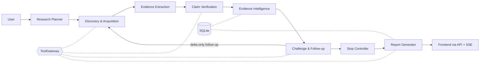

<div align="center">

# Sarvam

### Evidence-First Autonomous Research Agent

_Research that knows when it isn't done._

[](docs/STATUS.md)
[](LICENSE)


[Quickstart](#quickstart) · [How it works](#how-it-works) · [Documentation](#documentation) · [Report an issue](https://github.com/AdharshJolly/Sarvam/issues)

</div>

---

Sarvam is an evidence-first autonomous research agent. It takes an open-ended business question, plans the evidence it needs, gathers sources, and produces a structured report in which every finding is traceable to a stored passage. When the evidence is not yet sufficient, it says so.

## Table of Contents

- [Why Sarvam](#why-sarvam)
- [Features](#features)
- [Quickstart](#quickstart)
- [Configuration](#configuration)
- [Usage](#usage)
- [How it works](#how-it-works)
- [Assurance mechanisms](#assurance-mechanisms)
- [Tech stack](#tech-stack)
- [Project structure](#project-structure)
- [Development](#development)
- [Security](#security)
- [Failure handling](#failure-handling)
- [Evaluation](#evaluation)
- [Scope and roadmap](#scope-and-roadmap)
- [Project status](#project-status)
- [Documentation](#documentation)
- [Contributing](#contributing)
- [License](#license)

## Why Sarvam

Most AI research tools optimize for finding information and writing a fluent answer. Fluency is not support: a report can cite ten pages that all repeat one press release, quietly contain conflicting numbers, or stop because there was enough text to write with rather than enough evidence to decide. Citations and multi-step search are now table stakes. What is under-served is knowing whether the answer is supported.

Sarvam stops when a rule-based sufficiency policy is satisfied or a hard limit is hit, and it shows the reason. It is an evidence-assurance layer over a research pipeline; it does not claim to detect truth.

## Features

- **Plans** the question into decision dimensions, each with named evidence slots, a critical flag and allowed attributes.
- **Researches** each slot across multiple sources and records provenance for every one.
- **Extracts** addressable passages and claims that carry a verbatim quote from a stored passage.
- **Assures** the evidence with an independent verifier, origin clustering, numeric conflict detection and a rule-based coverage matrix.
- **Challenges** its own draft conclusion and runs targeted follow-up research.
- **Stops** by explicit rules and reports a final state with a termination reason.
- **Reports** findings that cite stored evidence IDs and carry a certainty label.

Four moments are always visible in the UI: the coverage matrix, independence collapse ("9 sources, 3 independent origins"), claim-to-passage drill-down, and the stop card.

## Core USP

> Research that knows when it isn't done.

The agent stops when a rule-based sufficiency policy is satisfied or a hard limit is hit, and it shows the reason. Four moments are always visible: the coverage matrix, independence collapse ("9 sources, 3 independent origins"), claim-to-passage drill-down, and the stop card. Sarvam is an evidence-assurance layer over a research pipeline; it does not claim to detect truth.

## Quickstart

### Prerequisites

- Python 3.11+ and [uv](https://docs.astral.sh/uv/)
- [Bun](https://bun.sh)
- GNU Make

### Run the offline demo

The demo replays the recorded canonical run: no API keys, no cost.

```bash
git clone https://github.com/AdharshJolly/Sarvam.git
cd Sarvam
make demo
```

Open <http://localhost:5173>, choose **REPLAY** in the run form and start the pre-filled canonical question.

> REPLAY only knows the one recorded question. For any other question, add your own keys (see [Configuration](#configuration)) and choose **LIVE**. A live run uses credits and takes a few minutes.

## Configuration

`make demo` copies `.env.example` to `.env` if none exists. Never commit `.env`. A LIVE run needs at most three variables; everything else has a default.

| Variable                                                                                   | Purpose                                                                           |
| ------------------------------------------------------------------------------------------ | --------------------------------------------------------------------------------- |
| `SARVAM_MODE`                                                                              | `replay` (offline, default) or `live`                                             |
| `SARVAM_LLM_PROVIDER`                                                                      | `openai`, `openrouter`, `groq`, or the base URL of any OpenAI-compatible endpoint |
| `SARVAM_LLM_API_KEY`                                                                       | LLM provider key                                                                  |
| `SARVAM_SEARCH_API_KEY`                                                                    | Search provider key (Tavily by default)                                           |
| `SARVAM_MAX_SEARCHES`, `SARVAM_MAX_FETCHES`, `SARVAM_MAX_LLM_CALLS`, `SARVAM_MAX_COST_USD` | Hard run budgets                                                                  |
| `SARVAM_MAX_FOLLOWUP_ROUNDS`                                                               | Upper bound on follow-up research rounds                                          |

The full list, with comments, is in [`.env.example`](.env.example).

## Usage

1. Start the stack with `make demo` (or `make dev` once dependencies are installed).
2. Enter a business question and pick **REPLAY** or **LIVE**.
3. Watch the run: the left rail shows the phase stepper, budget meters and LIVE/REPLAY badge; the central tabs show Matrix, Evidence, Conflicts, Challenge and Report; the right drawer shows the passage behind any claim.
4. Read the stop card for the final state and the reason the run ended.

A replayed run is always labelled REPLAY and is never presented as live.

## How it works

One backend process, one SQLite database, one frontend. A run is a single asyncio task driven by a deterministic controller. Every external effect (search, fetch, LLM) passes through a single ToolGateway.



| Component                    | Role                                                                                               |
| ---------------------------- | -------------------------------------------------------------------------------------------------- |
| Frontend                     | Vite + React + TypeScript SPA; renders REST snapshots and the SSE event stream.                    |
| API                          | FastAPI; runs, event stream, state, claim evidence, report, stop.                                  |
| Controller                   | Deterministic state machine; owns rounds, budgets, retries, wrap-up and the stop decision.         |
| ToolGateway                  | Only path to search, fetch and LLM; budgets, SSRF guard, concurrency, typed errors, record/replay. |
| Pipeline / Intel / Synthesis | Code modules that turn a question into sources, claims, assurance state and a report.              |
| Store                        | SQLite (WAL, no ORM) plus a local artifact folder; the events table is the audit log.              |

### Research lifecycle

Ten states: `PLAN`, `DISCOVER`, `ACQUIRE`, `EXTRACT`, `CLAIMS`, `VERIFY`, `ANALYZE`, `CHALLENGE`, `STOP POLICY`, `SYNTHESIZE`. Round 0 is the initial pass; follow-up rounds are created by coverage gaps and challenges and process only new sources and claims. At least one challenge round runs. If a hard limit hits first, the controller takes a wrap-up path and the stop card says the challenge was not completed.

### Evidence-first principles

- Evidence is the system of record; the report is a view over it.
- Every claim carries a passage ID and a quote that code checks occurs in that passage.
- Citations are rendered from stored IDs, never from model-typed URLs.
- Coverage counts independent origins, not pages.
- Contradictions stay visible; a losing claim is never dropped.
- Uncertainty is stated through certainty labels, not smoothed over.

Further reading: [docs/architecture](docs/architecture/README.md).

## Assurance mechanisms

| Mechanism            | Type                      | Purpose                                                                    |
| -------------------- | ------------------------- | -------------------------------------------------------------------------- |
| Quote guard          | Deterministic             | Reject claims whose quote is not in the cited passage.                     |
| Independent verifier | Separate LLM call         | Label claim-passage pairs supports / partial / contradicts / irrelevant.   |
| Origin clustering    | Deterministic             | Collapse copied or derivative sources; unknown independence stays unknown. |
| Numeric conflicts    | Deterministic + explainer | Normalize units, currency and period; flag conflicts above tolerance.      |
| Coverage             | Deterministic             | RED / AMBER / GREEN per slot with a human-readable reason.                 |
| Challenge loop       | LLM + rules               | Attack the weakest slots; outcomes assigned by rule.                       |
| Stop policy          | Deterministic             | Final state and termination reason as a pure function of stored tables.    |
| Report verifier      | Deterministic             | Remove or tag sentences without a claim ID or with unsupported numbers.    |

## Tech stack

| Layer     | Choice                                                                  |
| --------- | ----------------------------------------------------------------------- |
| Frontend  | Bun, Vite, React, TypeScript (strict), Tailwind CSS, native EventSource |
| Backend   | Python 3.11+, FastAPI, Uvicorn, Pydantic v2, asyncio, sqlite3           |
| Storage   | SQLite (WAL), local artifact folder                                     |
| Contracts | Pydantic models; JSON Schema and TypeScript types generated from them   |
| Tooling   | uv, pytest, ruff, GNU Make                                              |

## Project structure

```text
Sarvam/
├── contracts/       Canonical Pydantic models, event envelope, typed config; generated/ output
├── backend/         API, controller, gateway/, pipeline/, intel/, synth/, store/, prompts/
├── frontend/        Vite + React + TypeScript application
├── fixtures/        Synthetic corpus, expected outputs, golden questions
├── tests/           Unit tests, fixture tests, executable gates G1-G4
├── cache/recorded/  Canonical recorded runs for offline replay
├── docs/            SSOT, architecture, decisions, audit, research
└── scripts/         Helper scripts
```

## Development

| Command                          | What it does                                               |
| -------------------------------- | ---------------------------------------------------------- |
| `make install`                   | Install backend (uv) and frontend (Bun) dependencies       |
| `make dev`                       | Run backend and frontend together                          |
| `make backend` / `make frontend` | Run one side only                                          |
| `make lint` / `make typecheck`   | Ruff and TypeScript checks                                 |
| `make test`                      | Backend and frontend tests                                 |
| `make fixtures`                  | Fixture corpus suite                                       |
| `make gates`                     | Offline gate suites G1 to G4                               |
| `make contracts`                 | Regenerate `contracts/generated/` from the Pydantic models |
| `make check`                     | Full quality gate                                          |
| `make build`                     | Production frontend build                                  |

> Do not run `make check` with live keys in `.env`: it also runs the live G0 and G1 tests.

Contracts are canonical. Never edit `contracts/generated/` by hand, and record any change to `contracts/` or `backend/store/schema.sql` in the [change log](docs/decisions/README.md). The frontend uses Bun only; do not create npm, yarn or pnpm lockfiles.

## Security

Fetches go through an SSRF guard: http/https only, private, loopback, link-local and metadata addresses blocked, limited redirects, timeout, size cap, HTML only. Retrieved text is treated as untrusted data and isolated from instructions; extraction and verification calls have no tools, and outputs are schema-validated. Secrets live only in environment variables. See [docs/architecture/security.md](docs/architecture/security.md) for what is implemented versus planned.

## Failure handling

Every failure becomes a typed state visible in the event log and the UI: `RATE_LIMITED`, `SOURCE_UNAVAILABLE`, `SOURCE_EMPTY`, `STEP_FAILED`, `CLAIM_REJECTED`, `BLOCKED`. Hitting a budget or time limit triggers a wrap-up path rather than an error. A run can finish `INSUFFICIENT`; that is a valid result, not a software failure.

## Evaluation

Deterministic modules are tested against a 14-document fixture corpus with expected origins, conflicts and coverage. Five golden questions tune thresholds, with one held back as an untouched acceptance check. A 20-claim manual audit provides an independent unsupported-claim rate, reported without adjustment.

## Scope and roadmap

**In the MVP:** question intake, planner with slots, HTML search/fetch/extraction, passages, quote-verified claims, independent verification, origin clustering, numeric conflicts, coverage matrix, one to two challenge rounds, stop policy with reason, verified report with certainty labels, live event stream UI, hard budgets, typed failures, record/replay.

**Non-goals:** proving objective truth or replacing analysts; a single opaque confidence score; enterprise search, connectors, authentication, multi-user or monitoring; infrastructure beyond SQLite and one process; agent frameworks; PDF ingestion, vector retrieval and graph visualization in the MVP.

**Roadmap:** baseline comparison against a naive single-pass run, print-ready export, full decision sensitivity, cost/latency panel, prompt-injection demo, human source pinning, PDF ingestion, run history and diff, a larger golden set, freshness flags. Ranked in SSOT section 15.

## Project status

## Documentation

| Document                                                       | Purpose                                  |
| -------------------------------------------------------------- | ---------------------------------------- |
| [docs/ssot/SSOT_v2.docx](docs/ssot/SSOT_v2.docx)               | Single Source of Truth (canonical)       |
| [docs/STATUS.md](docs/STATUS.md)                               | Build status by task and gate, next plan |
| [docs/architecture](docs/architecture/README.md)               | Architecture as built                    |
| [docs/architecture/security.md](docs/architecture/security.md) | Security boundaries                      |
| [docs/decisions](docs/decisions/README.md)                     | ADRs and change log                      |
| [docs/audit](docs/audit/README.md)                             | Evaluation and manual audit              |
| [docs/research](docs/research/README.md)                       | External evidence base                   |
| [CLAUDE.md](CLAUDE.md)                                         | Operating manual for coding agents       |

## Contributing

Issues and pull requests are welcome. Please read the SSOT and [CLAUDE.md](CLAUDE.md) first, keep changes small and focused, write the test before the code, and make sure `make check` is green. Commit messages follow `T12: coverage calculator` or `chore: ...`.

## License

Released under the MIT License. See [LICENSE](LICENSE).
