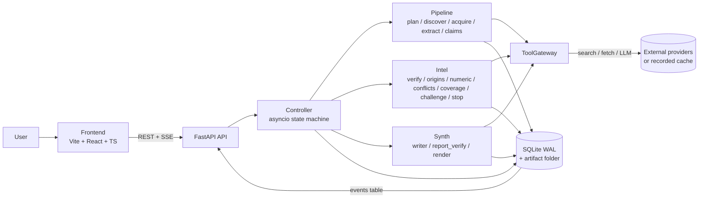

# Sarvam architecture

Derived from SSOT v2.0 sections 6, 7, 8 and 11. If this file and the SSOT disagree, the SSOT wins.

## System context

One backend process, one SQLite database, one frontend. A research run is a single asyncio task driven
by a deterministic controller. All external effects pass through the ToolGateway.

## Components

| Component | Location | Responsibility |
| --- | --- | --- |
| Frontend | `frontend/` | Renders run state from REST snapshots and the SSE event stream. Types come from `contracts/generated/`. |
| API | `backend/app.py` | Creates runs, streams events, serves state, claim evidence, report (7 endpoints, SSOT 11). |
| Controller | `backend/controller.py` | Owns lifecycle, rounds, budgets, retries, wrap-up and the stop decision. |
| ToolGateway | `backend/gateway/` | The only path to search, fetch, LLM. Budgets, SSRF guard, concurrency, typed errors, record/replay. |
| Pipeline | `backend/pipeline/` | Question to stored sources, passages and quote-verified claims. |
| Intel | `backend/intel/` | Claims to assurance state: verdicts, origins, conflicts, coverage, challenge, stop. Deterministic where possible. |
| Synthesis | `backend/synth/` | Verified claims to a report with citations resolvable to stored passages. |
| Store | `backend/store/` | SQLite (WAL, no ORM) system of record; `events` is the audit log and SSE source. |
| Contracts | `contracts/` | Pydantic models are canonical; JSON Schema and TypeScript are generated. |

## Runtime lifecycle (10 states)

PLAN -> DISCOVER -> ACQUIRE -> EXTRACT -> CLAIMS -> VERIFY -> ANALYZE -> CHALLENGE -> STOP POLICY -> SYNTHESIZE.

Round 0 runs states 1-7. CHALLENGE creates gap and challenge tasks and loops to DISCOVER on the delta
only, bounded by `MAX_FOLLOWUP_ROUNDS` (the only cycle). At least one challenge round must run; if a hard
limit hits first, the controller takes the wrap-up path (straight to STOP POLICY and SYNTHESIZE) and the
stop card says the challenge was not completed. The controller checks budgets before every gateway call.

## Iterative loop and stop controller

- Coverage is rule-based per slot from independent-origin counts (RED / AMBER / GREEN), never an LLM score.
- Marginal gain = slots whose state improved in the last round; zero gain after a completed challenge round ends the run.
- Final state (`SUFFICIENT`, `SUFFICIENT_WITH_CAVEATS`, `INSUFFICIENT`) is a pure function of coverage, conflicts and challenge outcomes, and is recomputed by a unit test for every stored run.
- Hard limits (budget, timeout, user stop) take precedence and trigger wrap-up.

## SSE event flow

Every transition, tool call and decision appends a row to `events` (envelope
`{id, run_id, ts, round, type, step_ms, tokens, cost_usd, payload}`). `GET /api/runs/{id}/events` streams
rows with `id > Last-Event-ID`, so the UI and the audit log are the same data. Replay reproduces the event
sequence except timestamps.

## Frontend / backend boundary

The frontend talks to the backend only through the 7 API endpoints and the event stream, using types
generated from the Pydantic models. It never defines its own domain shapes.

## Status

Bootstrap only: contracts, SQLite schema and event writer, health endpoint, gateway interfaces and the
frontend shell exist. Controller, pipeline, intel and synthesis are unimplemented (tasks T02-T15).
