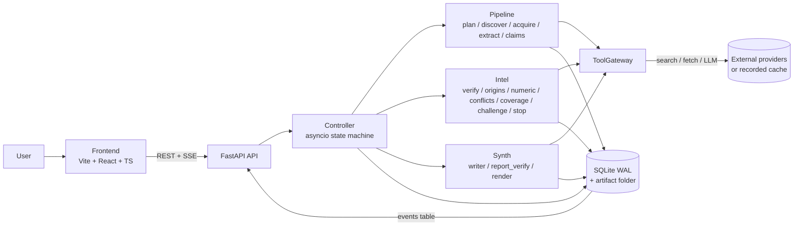

# Sarvam architecture

Derived from SSOT v2.0 sections 6, 7, 8 and 11. If this file and the SSOT disagree, the SSOT wins.

## System context

One backend process, one SQLite database, one frontend. A research run is a single asyncio task driven
by a deterministic controller. All external effects pass through the ToolGateway.

## Components

| Component | Location | Responsibility |
| --- | --- | --- |
| Frontend | `frontend/` | Renders run state from REST snapshots and the SSE event stream. Types come from `contracts/generated/`. |
| API | `backend/app.py` | Creates runs, streams events, serves state, claim evidence, report (7 endpoints, SSOT 11). |
| Controller | `backend/controller.py` | Owns lifecycle, rounds, budgets, retries, wrap-up and the stop decision. |
| ToolGateway | `backend/gateway/` | The only path to search, fetch, LLM. Budgets, SSRF guard, concurrency, typed errors, record/replay. |
| Pipeline | `backend/pipeline/` | Question to stored sources, passages and quote-verified claims. |
| Intel | `backend/intel/` | Claims to assurance state: verdicts, origins, conflicts, coverage, challenge, stop. Deterministic where possible. |
| Synthesis | `backend/synth/` | Verified claims to a report with citations resolvable to stored passages. |
| Store | `backend/store/` | SQLite (WAL, no ORM) system of record; `events` is the audit log and SSE source. |
| Contracts | `contracts/` | Pydantic models are canonical; JSON Schema and TypeScript are generated. |

## Runtime lifecycle (10 states)

PLAN -> DISCOVER -> ACQUIRE -> EXTRACT -> CLAIMS -> VERIFY -> ANALYZE -> CHALLENGE -> STOP POLICY -> SYNTHESIZE.

Round 0 runs states 1-7. CHALLENGE creates gap and challenge tasks and loops to DISCOVER on the delta
only, bounded by `MAX_FOLLOWUP_ROUNDS` (the only cycle). At least one challenge round must run; if a hard
limit hits first, the controller takes the wrap-up path (straight to STOP POLICY and SYNTHESIZE) and the
stop card says the challenge was not completed. The controller checks budgets before every gateway call.

## Iterative loop and stop controller

- Coverage is rule-based per slot from independent-origin counts (RED / AMBER / GREEN), never an LLM score.
- Marginal gain = slots whose state improved in the last round; zero gain after a completed challenge round ends the run.
- Final state (`SUFFICIENT`, `SUFFICIENT_WITH_CAVEATS`, `INSUFFICIENT`) is a pure function of coverage, conflicts and challenge outcomes, and is recomputed by a unit test for every stored run.
- Hard limits (budget, timeout, user stop) take precedence and trigger wrap-up.

## SSE event flow

Every transition, tool call and decision appends a row to `events` (envelope
`{id, run_id, ts, round, type, step_ms, tokens, cost_usd, payload}`). `GET /api/runs/{id}/events` streams
rows with `id > Last-Event-ID`, so the UI and the audit log are the same data. Replay reproduces the event
sequence except timestamps.

## Frontend / backend boundary

The frontend talks to the backend only through the 7 API endpoints and the event stream, using types
generated from the Pydantic models. It never defines its own domain shapes.

## Status

M0, the G2 intelligence layer and the G3 lifecycle are implemented offline (fixture-driven, fake
providers): contracts incl. the shared addendum, SQLite store, ToolGateway (budgets, SSRF guard,
fetch, structured LLM, record/replay), planner, discover, acquire, extract, claims with the quote
guard, the independent verifier, origin clustering, numeric conflicts, coverage and gap tasks, the
challenge loop with rule-based outcomes (`intel/challenge.py`), the stop policy as a pure function
(`intel/stop.py`), the round-based controller `controller.run_research` (round 0, then follow-up
rounds on the delta only, wrap-up, stop decision, synthesis), the report verifier with certainty
labels (`synth/report_verify.py`), the deterministic renderer and the full API including SSE.
The frontend renders every panel from REST and SSE. Task-level status: [../STATUS.md](../STATUS.md).

Not yet done: a live end-to-end run of the round loop against real providers (search budget and cost
are unmeasured), failure states end to end (T24), recorded canonical runs and offline replay (T25),
the audit sheet (T23), README run command (T26), additions.

Run execution: `POST /api/runs` creates the run and, outside the test env, starts `controller.run_research`
as an asyncio task on its own DB connection. SSE (`GET /runs/{id}/events`) polls the events table on
a separate connection and sends `id:` + `data:` frames only. Wrap-up (stop request, soft time, budget
limit, provider outage) skips the remaining stages, scores coverage from what is stored (no LLM
calls) and synthesizes from the evidence already stored.
